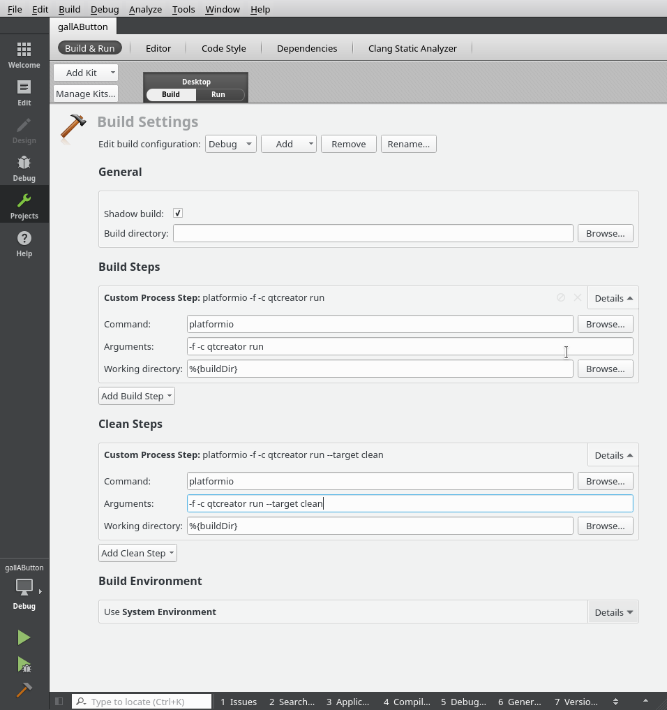
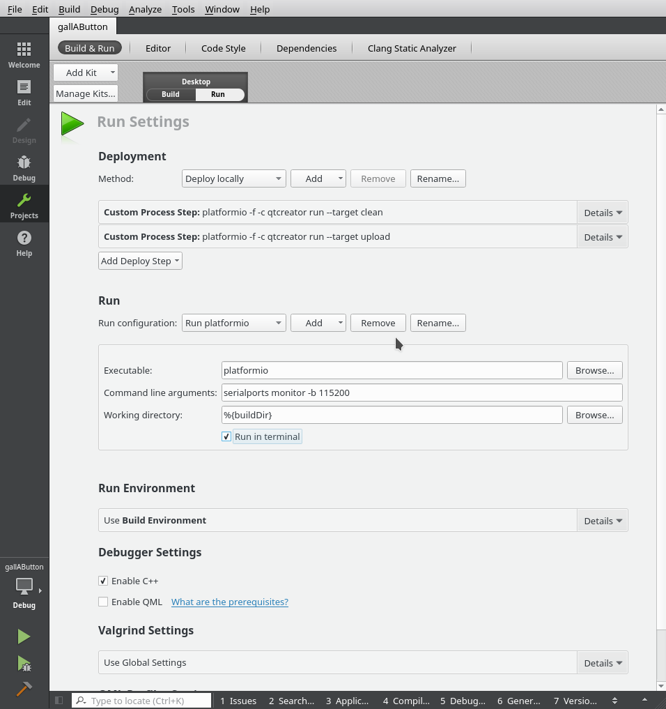

# gallAButton

Instructions for @Teopost ;-)

Install QTCreator

git clone https://github.com/gallochri/gallAButton.git

cd gallAButton
platformio init --ide qtcreator
mv platformio.pro gallAButton.pro

Open QTCreator
File -> Open File or Project -> (select gallAButton.pro) -> Configure Project
(Left panel) Projects ->

Build -> "Build All" or hammer icon   = Build project

Build -> Rebuild All                  = Clean and Build

Build -> Clean All                    = Clean all

Build -> Deploy All                   = Clean,Build & Upload

Build -> Run                          = Clean,Build,Upload & open Serial Monitor

Remenber to close serial monitor window before re-deploy.
