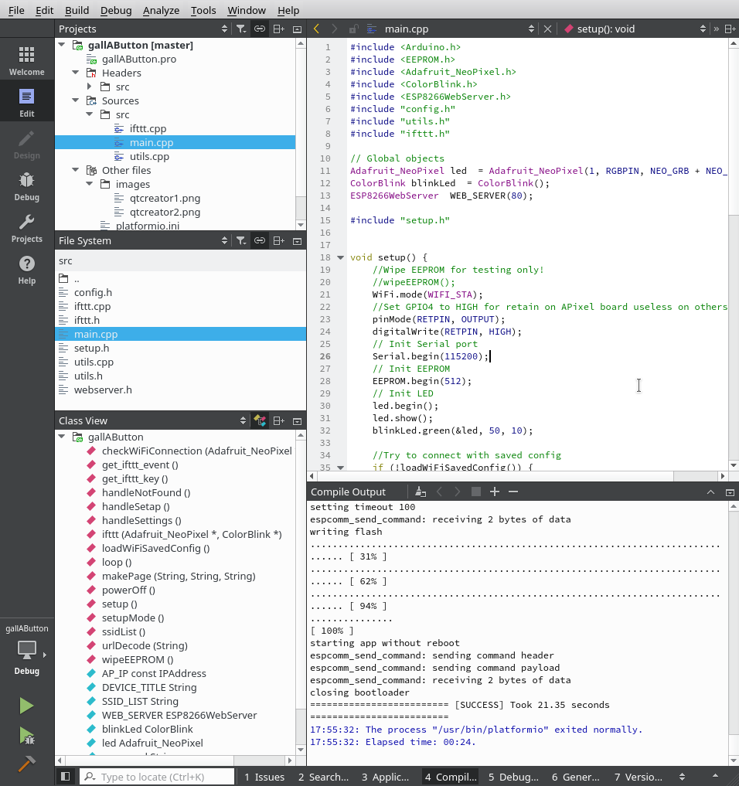

# gallAButton   [](https://travis-ci.org/gallochri/gallAButton)
A beautifull IOT button with a cagarissimo name !

[](http://www.youtube.com/watch?v=AoWVcrVlDQk)


Getting Started with QT Creator
---

**Install Platformio CLI and QTCreator**

```
$ git clone https://github.com/gallochri/gallAButton.git

$ cd gallAButton

$ platformio init --ide qtcreator

$ mv platformio.pro gallAButton.pro
````

**Open QTCreator**

Click on File -> Open File or Project -> (select gallAButton.pro) -> Configure Project

(Left panel) Projects ->




```
Build -> "Build All" or hammer icon   = Build project
Build -> Rebuild All                  = Clean and Build
Build -> Clean All                    = Clean all
Build -> Deploy All                   = Clean,Build & Upload
Build -> Run                          = Clean,Build,Upload & open Serial Monitor
````

> Remenber to close serial monitor window before re-deploy.

References
---
- https://github.com/teopost/iot-button
